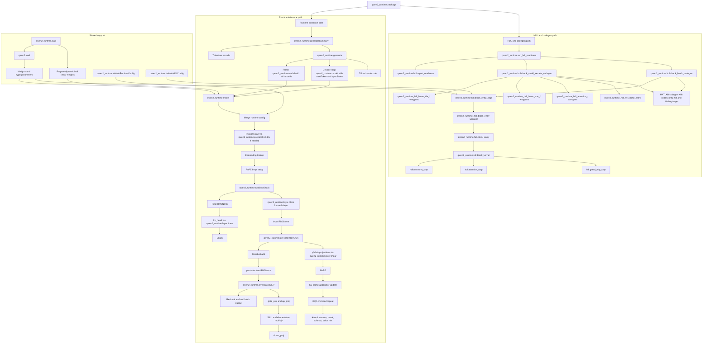

# qwen2_runtime Call Graph

This diagram separates the normal MATLAB inference path from the HDL/codegen path.

```mermaid
flowchart TD
    A[qwen2_runtime package] --> B[Runtime inference path]
    A --> C[HDL and codegen path]

    subgraph R[Runtime inference path]
        B --> B1[qwen2_runtime.generateSummary]
        B1 --> B2[Tokenizer.encode]
        B1 --> B3[qwen2_runtime.generate]
        B3 --> B4[Prefill: qwen2_runtime.model with full inputIds]
        B3 --> B5[Decode loop: qwen2_runtime.model with nextToken and layerStates]
        B3 --> B6[Tokenizer.decode]

        B4 --> M
        B5 --> M

        M[qwen2_runtime.model] --> M1[Merge runtime config]
        M1 --> M2[Prepare plan via qwen2_runtime.prepareForHDL if needed]
        M2 --> M3[Embedding lookup]
        M3 --> M4[RoPE freqs setup]
        M4 --> M5[qwen2_runtime.runBlockStack]
        M5 --> M6[Final RMSNorm]
        M6 --> M7[lm_head via qwen2_runtime.layer.linear]
        M7 --> M8[Logits]

        M5 --> L0[qwen2_runtime.layer.block for each layer]
        L0 --> L1[input RMSNorm]
        L1 --> L2[qwen2_runtime.layer.attentionGQA]
        L2 --> L3[Residual add]
        L3 --> L4[post-attention RMSNorm]
        L4 --> L5[qwen2_runtime.layer.gatedMLP]
        L5 --> L6[Residual add and block output]

        L2 --> A1[q/k/v/o projections via qwen2_runtime.layer.linear]
        A1 --> A2[RoPE]
        A2 --> A3[KV cache append or update]
        A3 --> A4[GQA KV head repeat]
        A4 --> A5[Attention score, mask, softmax, value mix]

        L5 --> G1[gate_proj and up_proj]
        G1 --> G2[SiLU and elementwise multiply]
        G2 --> G3[down_proj]
    end

    subgraph H[HDL and codegen path]
        C --> H1[qwen2_runtime.run_hdl_readiness]
        H1 --> H2[qwen2_runtime.hdl.report_readiness]
        H1 --> H3[qwen2_runtime.hdl.check_small_kernels_codegen]
        H1 --> H4[qwen2_runtime.hdl.check_block_codegen]

        H4 --> H5[qwen2_runtime.hdl.block_entry_args]
        H5 --> H6[qwen2_runtime_hdl_block_entry wrapper]
        H6 --> H7[qwen2_runtime.hdl.block_entry]
        H7 --> H8[qwen2_runtime.hdl.block_kernel]

        H8 --> H9[hdl.rmsnorm_step]
        H8 --> H10[hdl.attention_step]
        H8 --> H11[hdl.gated_mlp_step]

        H3 --> S1[qwen2_runtime_hdl_linear_tile_* wrappers]
        H3 --> S2[qwen2_runtime_hdl_linear_row_* wrappers]
        H3 --> S3[qwen2_runtime_hdl_attention_* wrappers]
        H3 --> S4[qwen2_runtime_hdl_kv_cache_entry]

        H4 --> H12[MATLAB codegen with coder.config hdl and Verilog target]
        H3 --> H12
    end

    subgraph D[Shared support]
        D1[qwen2_runtime.load] --> D2[qwen2.load]
        D2 --> D3[Weights and hyperparameters]
        D1 --> D4[Prepare dynamic-int8 linear weights]
        D4 --> M
        D3 --> M
        D3 --> H5

        D5[qwen2_runtime.defaultRuntimeConfig] --> M1
        D6[qwen2_runtime.defaultHDLConfig] --> H5
    end
```
